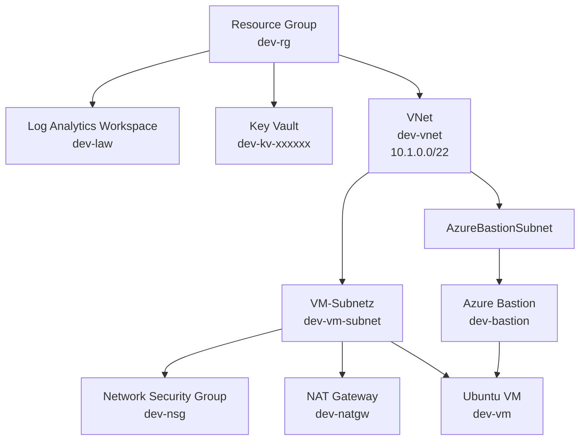

# Azure Terraform AVM Lab

## Projektübersicht

In diesem Projekt wird eine Azure-Infrastruktur mit Terraform und den Azure Verified Modules (AVM) erstellt. Die Infrastruktur wird modular aufgebaut und umfasst Netzwerk-, Sicherheits-, Monitoring- und Compute-Ressourcen.

Die Konfiguration verwendet eine Entwicklungsumgebung in der Azure-Region `switzerlandnorth`. Die Ressourcennamen beginnen mit dem Präfix `dev`.

Die Umsetzung orientiert sich an der offiziellen [AVM-Anleitung zur Solution-Entwicklung mit Terraform](https://azure.github.io/Azure-Verified-Modules/usage/solution-development/terraform/). Dabei werden einzelne Azure Verified Modules schrittweise zu einer vollständigen Lösung verbunden. Die Struktur mit `terraform.tf`, `variables.tf`, `development.tfvars` und `main.tf` folgt ebenfalls diesem Ansatz.

## Zielsetzung

Das Projekt dient dazu, eine abgesicherte Linux-VM in Azure bereitzustellen. Die VM befindet sich in einem eigenen virtuellen Netzwerk und besitzt keine öffentliche IP-Adresse. Der Zugriff erfolgt über Azure Bastion. Für ausgehenden Netzwerkverkehr wird ein NAT Gateway verwendet.

Zusätzlich werden zentrale Sicherheits- und Monitoring-Komponenten eingerichtet:

- eine Ressourcengruppe für alle Ressourcen
- ein Log Analytics Workspace für Protokolle und Diagnosedaten
- ein Key Vault für den privaten SSH-Schlüssel
- ein virtuelles Netzwerk mit getrennten Subnetzen
- eine Network Security Group mit einer SSH-Regel
- Azure Bastion für den sicheren administrativen Zugriff
- ein NAT Gateway für ausgehenden Netzwerkverkehr
- eine Ubuntu-VM mit einer verwalteten Netzwerkschnittstelle

## Architektur



Die Ressourcen werden über AVM-Module miteinander verbunden. Das VNet verwendet den Adressbereich `10.1.0.0/22` und wird in zwei Subnetze aufgeteilt:

- `dev-vm-subnet` für die virtuelle Maschine
- `AzureBastionSubnet` für Azure Bastion

Das VM-Subnetz ist mit dem NAT Gateway und der Network Security Group verbunden. Azure Bastion verwendet das separate Bastion-Subnetz und ermöglicht den Zugriff auf die VM, ohne dass die VM selbst eine öffentliche IP-Adresse benötigt.

In der aktuellen Konfiguration werden die Diagnostic Settings von Azure Bastion an den Log Analytics Workspace weitergeleitet. Für die VM und die übrigen Ressourcen sind derzeit keine eigenen Diagnostic Settings definiert.

Der Key Vault ist nicht direkt an die VM angebunden. Terraform speichert den privaten Teil des SSH-Schlüssels als Secret im Key Vault und hinterlegt den öffentlichen Schlüssel bei der VM. Der Zugriff auf die VM erfolgt anschliessend über Azure Bastion.

## Terraform-Konfiguration

### Terraform und Provider

Die Datei `terraform.tf` legt die Terraform- und Provider-Versionen fest:

| Komponente | Vorgabe |
|---|---|
| Terraform | `~> 1.9` |
| AzureRM Provider | `>= 4.80.0` |
| Random Provider | `~> 3.9` |

Der AzureRM-Provider wird mit aktivierten Standard-Features verwendet. Die Anmeldung erfolgt über die Azure CLI.

### Azure Verified Modules

Die Infrastruktur verwendet folgende AVM-Module:

| Ressource | AVM-Modul | Version |
|---|---|---:|
| Resource Group | `Azure/avm-res-resources-resourcegroup/azurerm` | `0.4.0` |
| Log Analytics Workspace | `Azure/avm-res-operationalinsights-workspace/azurerm` | `0.5.1` |
| Key Vault | `Azure/avm-res-keyvault-vault/azurerm` | `0.10.2` |
| Virtual Network | `Azure/avm-res-network-virtualnetwork/azurerm` | `0.19.0` |
| Bastion Host | `Azure/avm-res-network-bastionhost/azurerm` | `0.9.0` |
| NAT Gateway | `Azure/avm-res-network-natgateway/azurerm` | `0.3.2` |
| Network Security Group | `Azure/avm-res-network-networksecuritygroup/azurerm` | `0.5.1` |
| Virtual Machine | `Azure/avm-res-compute-virtualmachine/azurerm` | `0.21.0` |
| Key Vault Secret | `Azure/avm-res-keyvault-vault/azurerm//modules/secret` | `0.9.1` |

AVM übernimmt die Erstellung der Azure-Ressourcen und stellt dafür standardisierte Eingaben und Ausgaben bereit. Dadurch können beispielsweise Resource IDs direkt zwischen den Modulen weitergegeben werden.

Bei der Entwicklung wurden die Module einzeln aufgebaut und ihre Ausgaben anschliessend als Eingaben für abhängige Ressourcen verwendet. So wird beispielsweise die Resource ID des NAT Gateways und der Network Security Group an das VM-Subnetz übergeben. Die Resource ID des Bastion-Subnetzes wird wiederum an das Bastion-Modul und die Resource ID des VM-Subnetzes an die Netzwerkkarte der VM weitergereicht.

## Bereitgestellte Ressourcen

| Ressource | Name | Zweck |
|---|---|---|
| Resource Group | `dev-rg` | Gemeinsamer Container für die Azure-Ressourcen |
| Log Analytics Workspace | `dev-law` | Speicherung und Auswertung von Logs |
| Key Vault | `dev-kv-<zufälliger-suffix>` | Speicherung des privaten SSH-Schlüssels |
| Virtual Network | `dev-vnet` | Privates Netzwerk mit dem Bereich `10.1.0.0/22` |
| VM-Subnetz | `dev-vm-subnet` | Netzwerkbereich für die VM |
| Bastion-Subnetz | `AzureBastionSubnet` | Vorgeschriebenes Subnetz für Azure Bastion |
| NAT Gateway | `dev-natgw` | Ausgehender Netzwerkverkehr der VM |
| NAT Public IP | `dev-natgw-pip` | Öffentliche IP-Adresse des NAT Gateways |
| Network Security Group | `dev-nsg` | Steuerung des eingehenden Netzwerkverkehrs |
| Azure Bastion | `dev-bastion` | Sicherer Zugriff auf die VM über das Azure Portal |
| Linux VM | `dev-vm` | Ubuntu Server 22.04 LTS |
| Network Interface | `dev-nic` | Verbindung der VM mit dem VM-Subnetz |

## Variablen

Die Eingabewerte werden in `variables.tf` definiert und in `development.tfvars` für die Entwicklungsumgebung gesetzt:

| Variable | Entwicklungswert | Beschreibung |
|---|---|---|
| `name_prefix` | `dev` | Präfix für die Ressourcennamen |
| `location` | `switzerlandnorth` | Azure-Region |
| `virtual_network_cidr` | `10.1.0.0/22` | Adressbereich des virtuellen Netzwerks |
| `tags.environment` | `development` | Kennzeichnung der Umgebung |
| `tags.owner` | `dev-team` | Verantwortliche Gruppe |

Das VNet wird mit `cidrsubnet` in zwei gleich grosse Subnetze aufgeteilt. Dadurch entstehen zwei `/23`-Subnetze innerhalb des `/22`-Adressbereichs.

## Sicherheitskonzept

### Key Vault und SSH-Schlüssel

Terraform erzeugt ein RSA-Schlüsselpaar mit 4096 Bit. Der öffentliche Schlüssel wird für die Anmeldung an der VM verwendet. Der private Schlüssel wird als Secret mit dem Namen `ssh-private-key` im Key Vault gespeichert.

Der Key Vault ist standardmässig gegen Zugriffe aus dem Netzwerk geschützt:

- Standardaktion: `Deny`
- Ausnahme: vertrauenswürdige Azure-Dienste über `AzureServices`
- zusätzlich wird die aktuell erkannte öffentliche IP-Adresse zugelassen

Die öffentliche IP-Adresse wird über `https://ifconfig.me/ip` ermittelt. Dadurch kann Terraform den Key Vault von der aktuellen Entwicklungsumgebung aus erreichen.

### Netzwerkzugriff

Die VM erhält keine öffentliche IP-Adresse. Der administrative Zugriff erfolgt über Azure Bastion. Die Network Security Group enthält aktuell eine eingehende TCP-Regel für Port `22`.

Die SSH-Regel verwendet in der vorliegenden Konfiguration `*` als Quelladresse. Das erlaubt SSH-Zugriffe aus beliebigen Quellnetzen und sollte für eine reale Produktionsumgebung eingeschränkt werden. Besser wäre beispielsweise die eigene feste öffentliche IP-Adresse oder ein privates Verwaltungsnetz.

### Rollen und Berechtigungen

Dem im Code eingetragenen Principal wird im Key Vault die Rolle **Key Vault Secrets Officer** zugewiesen. Diese feste Principal-ID sollte in produktiven Projekten nicht hartcodiert werden, sondern über eine Variable oder eine zentral verwaltete Identität konfiguriert werden.

## Terraform-Ablauf

### Voraussetzungen

Installiert und verfügbar sein müssen:

- Terraform
- Azure CLI
- ein Azure-Abonnement mit ausreichenden Berechtigungen

Bei Verwendung der AVM-Module benötigt Terraform Zugriff auf die Terraform Registry.

### Azure anmelden

```bash
az login
az account show
```

Falls mehrere Abonnements verfügbar sind, kann das gewünschte Abonnement gesetzt werden:

```bash
az account set --subscription "SUBSCRIPTION_ID_ODER_NAME"
```

### Terraform initialisieren

Im Projektordner wird Terraform initialisiert:

```bash
terraform init
```

Dabei werden die Provider und die verwendeten AVM-Module heruntergeladen. Falls eine `.terraform.lock.hcl` erzeugt wird, hält sie die verwendeten Provider-Versionen fest. In diesem Projekt wird sie aktuell durch `.gitignore` ausgeschlossen.

### Konfiguration prüfen

```bash
terraform validate
```

`terraform validate` prüft die Syntax und die interne Konfiguration. Der Befehl führt noch keine Änderungen in Azure durch und kann vor dem Plan oder Apply ausgeführt werden.

### Ausführungsplan erstellen

```bash
terraform plan -var-file="development.tfvars"
```

Der Plan zeigt, welche Ressourcen Terraform erstellen, ändern oder löschen würde. Vor dem Anwenden sollte der Plan auf unerwartete Änderungen geprüft werden.

### Infrastruktur bereitstellen

```bash
terraform apply -var-file="development.tfvars"
```

Terraform fragt vor der Ausführung nach einer Bestätigung. Erst nach der Eingabe von `yes` werden die Ressourcen in Azure erstellt oder aktualisiert.

### Infrastruktur entfernen

Wenn die Testumgebung nicht mehr benötigt wird, kann sie wieder entfernt werden:

```bash
terraform destroy -var-file="development.tfvars"
```

Dieser Befehl löscht alle von Terraform verwalteten Ressourcen. Er darf nur ausgeführt werden, wenn die Umgebung nicht mehr benötigt wird.

## Typische Terraform-Ressourcen im Projekt

### Zufälliger Key-Vault-Suffix

Key Vault-Namen müssen innerhalb von Azure eindeutig sein. Deshalb wird ein sechs Zeichen langer zufälliger Suffix erzeugt:

```hcl
resource "random_string" "name_suffix" {
	length  = 6
	special = false
	upper   = false
}
```

Der Key Vault erhält dadurch beispielsweise einen Namen wie `dev-kv-fo1eez`.

### Dynamische öffentliche IP-Adresse

Die öffentliche IP-Adresse der aktuellen Entwicklungsumgebung wird über eine HTTP-Datenquelle ermittelt und für die Key-Vault-Firewall verwendet:

```hcl
data "http" "my_ip" {
	url = "https://ifconfig.me/ip"
}
```

Die Adresse wird anschliessend mit `chomp` als einzelne IP-Regel übergeben.

### Ubuntu-VM

Die VM verwendet:

- Betriebssystem: Ubuntu Server 22.04 LTS
- Architektur: Linux
- Grösse: `Standard_D2s_v5`
- Benutzername: `azureuser`
- Authentifizierung: SSH-Schlüsselpaar
- öffentliche VM-IP: keine

## State und Geheimnisse

Terraform speichert den Infrastrukturzustand in `terraform.tfstate`. Dieser Zustand kann sensible Informationen enthalten, beispielsweise Resource IDs, Konfigurationsdetails oder geheime Werte aus Ressourcen. Die Datei wird deshalb über `.gitignore` ausgeschlossen und darf nicht öffentlich veröffentlicht werden.

Auch private Schlüssel, `.tfvars`-Dateien und Backup-State-Dateien gehören nicht in ein öffentliches Repository. Der private SSH-Schlüssel sollte nur über den Key Vault oder einen anderen sicheren Secret-Speicher verwaltet werden.
