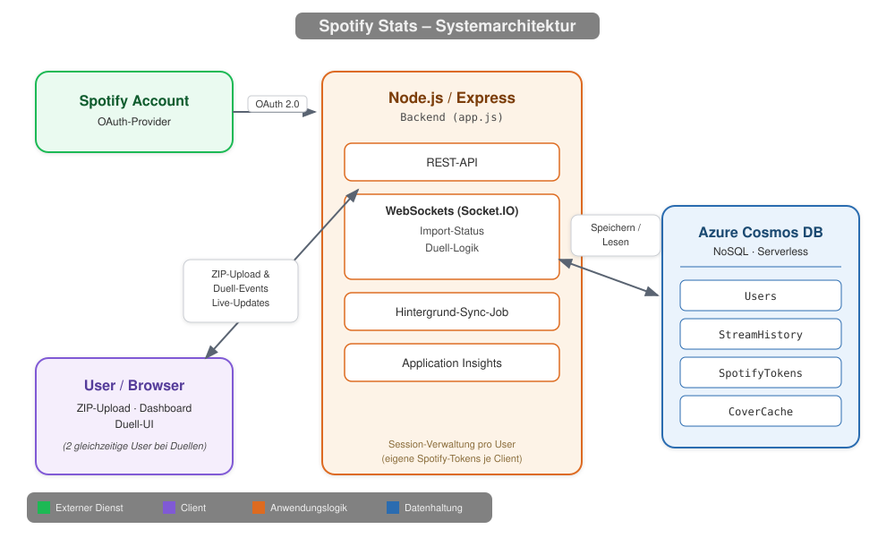

# Spotify Stats – Vollständige Projekt- & Setup-Dokumentation

## Ausgangslage & Zielsetzung

Ziel von **Spotify Stats** ist es, persönliche Spotify-Hörstatistiken (Top-Künstler, Top-Tracks, Streaming-Historie) abzurufen, zu analysieren und in einer NoSQL-Datenbank zu speichern.

Das Besondere an dieser Anwendung:

- **OAuth 2.0 Integration:** Sicheres Login direkt über das eigene Spotify-Konto.
- **ZIP-Import von Daten:** Benutzer können ihren von Spotify heruntergeladenen Streaming-Verlauf (ZIP- oder JSON-Dateien) hochladen.
- **Echtzeit-Verarbeitung:** Status-Updates via WebSockets (`socket.io`) während des Datenimports.
- **Live-Multiplayer-Duelle:** Zwei eingeloggte User können sich über `socket.io` gegenseitig zu einem Musik-Quiz herausfordern (Challenge, Annahme/Ablehnung, rundenbasierte Fragen mit Timer).
- **Highscores & globales Leaderboard:** Ergebnisse werden pro User in Cosmos DB gespeichert und global vergleichbar gemacht.
- **Application Insights:** Clientseitiges Monitoring via Azure Monitor JS-SDK, eingebunden direkt im HTML-Frontend.
- **Cloud-Infrastruktur als Code:** Automatische Bereitstellung einer Azure Cosmos DB und eines Node.js App Services via Azure Bicep, deploybar auch über die Azure Developer CLI (`azd`).

---

---

## Wichtige Voraussetzung: Spotify Premium

>**Achtung:** Für das Testen und Ausführen dieser App wird **zwingend ein Spotify Premium-Account** benötigt (entweder der eigene Account oder der eines im Spotify Developer Portal registrierten Test-Users). Gratis-Accounts haben durch API-Einschränkungen von Spotify keinen vollständigen Zugriff auf alle benötigten Schnittstellen.

---

## Systemarchitektur & Komponenten

Das Projekt besteht aus drei Hauptkomponenten:



!!! info "Kommunikation und Datenhaltung"
    Für normale Abfragen kommuniziert der Browser über REST mit dem Backend.
    Für Echtzeit-Funktionen wie Import-Fortschritt und Duelle wird eine
    dauerhafte WebSocket-Verbindung verwendet.

    Cosmos DB ist ausschliesslich über das Backend erreichbar und speichert
    Nutzerdaten, Streaming-Historie, Spotify-Tokens und zwischengespeicherte Cover-Art.

### `app.js` (Backend)

Die Anwendung besteht aus einer über 6.500 Zeilen langen `app.js`.

Darin befinden sich der Express-Server, die API-Routen, die Realtime-Logik und das serverseitig gerenderte Frontend mit HTML, CSS und JavaScript.

Ursprünglich war geplant, den Code auf mehrere Dateien aufzuteilen. Bei der Umsetzung gab es jedoch Komplikationen. Deshalb habe ich mich entschieden, alle Bestandteile in einer zentralen Datei zu behalten.

- **Express-Server:** Stellt die API-Routen und Session-Verwaltung bereit (`express-session`, Cookies mit 1 Stunde Gültigkeit, `secure`-Flag automatisch je nach Umgebung).
- **Spotify API Integration:** Steuert Login, Token-Handling und Profilabfragen via `spotify-web-api-node`. Für jeden Request wird eine eigene API-Instanz mit den User-Tokens aus der Session gebaut, damit mehrere User parallel eingeloggt sein können, ohne sich gegenseitig zu überschreiben.
- **Upload Engine:** Liest hochgeladene ZIP-Dateien im Arbeitsspeicher aus (`multer` & `adm-zip`) mit einem Limit von 200 MB.
- **Asynchrone Import-Jobs:** Der ZIP-Import läuft als Hintergrund-Job (`jobId`), dessen Fortschritt über einen Polling-Endpunkt (`/api/import/spotify/job/:jobId`) abgefragt werden kann.
- **WebSockets (`socket.io`):** Sendet den Verarbeitungsfortschritt live an den Browser und steuert das komplette Multiplayer-Duell-System (Challenge senden/annehmen/ablehnen, Rundenfragen, Antworten, Timer, Online-Präsenz).
- **Hintergrund-Sync:** Ein periodischer Job (`setInterval`) synchronisiert die Streaming-Historie aller bekannten User regelmässig neu aus der Spotify API in Cosmos DB.
- **Application Insights:** Bindet clientseitig das Azure Monitor JS-SDK ein, sofern eine Connection-String-Umgebungsvariable gesetzt ist.
- **Zeitzonen-Logging:** Ein eigenes Logging-Format gibt bei jeder Konsolenausgabe die Zeit in der Zeitzone `Europe/Zurich` mit aus.

#### Wichtigste API-Routen

| Route | Methode | Zweck |
|---|---|---|
| `/login` | GET | Leitet zur Spotify-OAuth-Autorisierung weiter. |
| `/` | GET | Login-Seite bzw. (nach OAuth-Redirect mit `code`) das Dashboard. |
| `/api/control/:action` | GET | Steuert die aktuelle Wiedergabe (Play/Pause/Skip etc.). |
| `/api/now-playing` | GET | Liefert den aktuell gespielten Track. |
| `/api/stats/month` | GET | Monatsauswertung der Top-Tracks/-Künstler. |
| `/api/stats/available-months` | GET | Liste der Monate, für die Daten vorliegen. |
| `/api/highscores/me` | GET | Eigene Highscores der Minigames. |
| `/api/highscores` | POST | Speichert ein neues Highscore-Ergebnis. |
| `/api/highscores/global` | GET | Globales Leaderboard aller User. |
| `/stats` | GET | Statistik-Ansicht. |
| `/api/import/spotify` | POST | Startet den ZIP-Import als Hintergrund-Job. |
| `/api/import/spotify/job/:jobId` | GET | Fragt den Fortschritt eines laufenden Import-Jobs ab. |

### `main.bicep` (Infrastruktur als Code)

- Erstellt eine Azure Cosmos DB (Serverless, `GlobalDocumentDB`) mit der Datenbank `SpotifyStats` und dem Container `StreamHistory` (Partition Key `/userId`).
- Erstellt einen Azure App Service Plan (B1 Linux) mit Node.js 22 LTS und den nötigen App Settings (Cosmos-Zugangsdaten, Spotify-Zugangsdaten, Session-Secret).
- **Hinweis:** Die App selbst legt beim Start zusätzlich zu `StreamHistory` noch drei weitere Container automatisch an (`Users`, `SpotifyTokens`, `CoverCache`) — dank Serverless-Modus ist das ohne vorherige Bereitstellung im Bicep-Template möglich. Die Container-Übersicht in Cosmos DB ist also umfangreicher als im Infrastruktur-Skript ersichtlich.

### Azure-Ressourcen im Portal

| Ressource | Name | Zweck |
|---|---|---|
| App Service | `app-spotify-insights` | Führt die Node.js-Anwendung aus. |
| App Service Plan | `asp-spotify-insights` | Stellt die Rechenleistung für den App Service bereit. |
| Cosmos DB | `cosmos-spotify-insights` | Speichert die Anwendungs- und Streaming-Daten. |
| Application Insights | `spotify-app-insights` | Sammelt Monitoring- und Telemetriedaten. |
| Log Analytics Workspace | Azure-Workspace | Speichert und analysiert Protokolle. |
| Alert-Regeln | verschiedene Regeln | Benachrichtigen bei Fehlern oder auffälligen Messwerten. |

### `azure.yaml` (Azure Developer CLI)

Das Projekt verwendet die **Azure Developer CLI (`azd`)** für die Bereitstellung von Infrastruktur und Anwendung:

```yaml
name: spotify-stats-dashboard
metadata:
  template: appservice-node
services:
  app:
    project: .
    host: appservice
    language: js
```

Die verwendete Azure-Umgebung heisst `spotify-insights`.

### `package.json` (Abhängigkeiten)

| Paket | Version | Zweck |
|---|---|---|
| `express` | ^4.19.2 | Webserver / Routing |
| `express-session` | ^1.19.0 | Session- & Cookie-Verwaltung |
| `socket.io` | ^4.8.1 | Echtzeit-Kommunikation (Import-Status, Duelle) |
| `spotify-web-api-node` | ^5.0.2 | Spotify-API-Client (OAuth, Tracks, Player) |
| `@azure/cosmos` | ^4.2.0 | Anbindung an Azure Cosmos DB |
| `multer` | ^2.2.0 | Datei-Uploads (ZIP-Import) |
| `adm-zip` | ^0.6.0 | Entpacken der Spotify-Export-ZIPs im Speicher |
| `dotenv` | ^17.4.2 | Laden der `.env`-Umgebungsvariablen |

### `.env` (Umgebungsvariablen)

- Enthält API-Schlüssel, Ports und Verbindungsdaten, damit keine sensiblen Informationen im Git-Repository landen.

---

## Schritt-für-Schritt-Anleitung

### Schritt 1: Spotify Developer Portal konfigurieren

1. Öffne das Spotify Developer Dashboard und melde dich mit deinem Spotify Premium-Account an.
2. Klicke auf **Create App**.
3. Vergebe einen **App Name** und eine **Description**.
4. Trage unter **Redirect URIs** die Callback-Adresse deiner lokalen Anwendung ein:

  ```text
  http://127.0.0.1:8000/
  ```

5. Speichere die App und notiere dir die **Client ID** und das **Client Secret**.

### Schritt 2: Lokale Umgebung vorbereiten

Repository klonen:

```bash
git clone https://github.com/dv23m236/spotify-stats.git
cd spotify-stats
```

Erstelle eine `.env`-Datei aus der Vorlage `.env.example`:

```bash
cp .env.example .env
```

Befülle die `.env`-Datei im Editor mit deinen Daten:

```env
# Spotify API Zugangsdaten (aus dem Developer Dashboard)
SPOTIFY_CLIENT_ID=deine_client_id_hier
SPOTIFY_CLIENT_SECRET=dein_client_secret_hier

# Zufälliger Schlüssel für Express-Sessions
SESSION_SECRET=zufaelliger_langer_string_123456

# Optional: Azure Cosmos DB (falls lokal genutzt oder manuell angelegt)
COSMOS_ENDPOINT=https://dein-account.documents.azure.com:443/
COSMOS_KEY=dein_cosmos_primary_key

# Lokaler Server-Port
PORT=8000
```

### Schritt 3: Abhängigkeiten installieren & Server starten

Pakete installieren:

```bash
npm install
```

Server lokal ausführen:

```bash
npm start
```

Die Anwendung ist nun unter `http://localhost:8000` erreichbar.

### Schritt 4: Azure-Infrastruktur bereitstellen (`main.bicep`)

Die Bereitstellung erfolgt über die Azure Developer CLI. Sie verwendet die im Projekt gespeicherte Umgebung `spotify-insights` und stellt sowohl die Infrastruktur als auch den Anwendungscode bereit.

```bash
# 1. In den Projektordner wechseln
cd spotify-stats

# 2. Im Azure-Konto anmelden
azd auth login

# 3. Infrastruktur und Anwendung bereitstellen
azd up
```

### Schritt 5: Produktions-Redirect-URI bei Spotify eintragen

Nach dem Deployment ist die Web-App unter `https://app-spotify-insights.azurewebsites.net/` erreichbar. Trage diese Adresse im Spotify Developer Dashboard unter **Redirect URIs** ein:

```text
https://app-spotify-insights.azurewebsites.net/
```

Die Adresse muss mit dem abschliessenden `/` eingetragen werden, da die Anwendung den OAuth-Callback auf der Root-Route verarbeitet. Nach dem Speichern kann der Login über die veröffentlichte Web-App getestet werden.

### Azure Portal: Kontrolle der Web-App-Konfiguration

Die Anwendung läuft im Azure App Service `app-spotify-insights`. Die App Settings können im Azure Portal unter **App Service** > **Settings** > **Environment variables** kontrolliert werden:

- `COSMOS_ENDPOINT`, `COSMOS_KEY` und `COSMOS_DATABASE_NAME`
- `SPOTIFY_CLIENT_ID` und `SPOTIFY_CLIENT_SECRET`
- `SESSION_SECRET`
- `SCM_DO_BUILD_DURING_DEPLOYMENT`

Geänderte Einstellungen müssen gespeichert werden; Azure startet die Web-App danach neu. Unter **Log stream** lassen sich Startfehler und fehlende Umgebungsvariablen prüfen. Geheimnisse dürfen weder in Git noch in Screenshots oder Dokumentation gespeichert werden.

### Application Insights und Überwachung

Für das Projekt ist die Application-Insights-Ressource `spotify-app-insights` vorhanden. Zusätzlich gibt es einen Log-Analytics-Workspace sowie Alert-Regeln für erkannte Fehler und hohe Frontend-Fehlerraten. Der Connection String von Application Insights muss im App Service als `APPLICATIONINSIGHTS_CONNECTION_STRING` hinterlegt sein, damit das clientseitige Monitoring Daten sendet.

---

## Wichtige Code-Erklärungen & Hürden

### Bereinigung von Namen in Azure Bicep

**Problem:** Azure Cosmos DB erlaubt keine Punkte (`.`) im Ressourcennamen. Wenn `environmentName` Sonderzeichen oder Punkte enthielt, schlug das Deployment fehl.

**Lösung:** In `main.bicep` wurde eine automatische Ersetzung integriert:

```bicep
var cleanCosmosName = replace('cosmos-${environmentName}', '.', '')
```

### Handhabung grosser Dateiuploads

**Problem:** Spotify-Export-Dateien (ZIP-Archive) können über mehrere Jahre sehr gross werden.

**Lösung:** In `app.js` wurde das Upload-Limit auf 200 MB angehoben und als RAM-Buffer gewählt:

```javascript
const MAX_IMPORT_UPLOAD_BYTES = 200 * 1024 * 1024; // 200 MB
const upload = multer({
  storage: multer.memoryStorage(),
  limits: { fileSize: MAX_IMPORT_UPLOAD_BYTES }
});
```

### Fortschrittsanzeige via WebSockets

**Funktionsweise:** Beim Importieren tausender Streams im Hintergrund würde die HTML-Seite ohne Rückmeldung einfrieren. Durch `socket.io` wird bei jedem verarbeiteten JSON-Block ein Event an den Browser geschickt, um den Ladebalken in Echtzeit zu aktualisieren. Der Import selbst läuft zusätzlich als asynchroner Job mit eigener `jobId`, damit ein Seiten-Reload oder Verbindungsabbruch den Fortschritt nicht verloren gehen lässt — der Client kann den Status jederzeit über den Job-Endpunkt neu abfragen.

### Mehrbenutzerfähigkeit ohne globale Tokens

**Problem:** Eine einzelne globale Spotify-API-Instanz mit gespeicherten Tokens würde bei mehreren gleichzeitigen Usern zu Konflikten führen (User A bekäme die Daten von User B).

**Lösung:** Für jeden eingehenden Request wird bei Bedarf eine eigene `SpotifyWebApi`-Instanz erzeugt und mit den Access-/Refresh-Tokens aus der jeweiligen Express-Session bestückt. Dadurch sind mehrere parallele Logins (z. B. für die Duell-Funktion) sauber voneinander getrennt.

### Cosmos-Datenmodell mit vier Containern

Obwohl `main.bicep` nur den Container `StreamHistory` explizit anlegt, erstellt `app.js` beim Start dank Serverless-Modus automatisch drei weitere Container in derselben Datenbank:

| Container | Partition Key | Inhalt |
|---|---|---|
| `Users` | `/userId` | Nutzerprofile / Metadaten |
| `StreamHistory` | `/userId` | Importierte bzw. synchronisierte Streaming-Historie |
| `SpotifyTokens` | `/userId` | Persistierte Access-/Refresh-Tokens für den Hintergrund-Sync |
| `CoverCache` | `/userId` | Zwischengespeicherte Cover-Art-URLs |

---

## Hinweis zum KI-gestützten Entwicklungsprozess

Der Quellcode dieses Projekts wurde primär mit Unterstützung von **GitHub Copilot** erstellt.

Meine Rolle verlagerte sich dabei auf:

1. **Architektur- und Konzeptplanung:** Festlegen der benötigten Komponenten (Backend, Datenbank, WebSocket und Cloud-Ressourcen).
2. **Prompt-Engineering und Anweisungsgabe:** Präzises Formulieren der Anforderungen und Randbedingungen.
3. **Debugging und Troubleshooting:** Erkennen und Beheben von Laufzeitfehlern, Grenzfällen und Cloud-Einschränkungen.

---

## Spickzettel & Fehlerbehebung (Troubleshooting)

### Befehlsübersicht

| Befehl | Beschreibung |
|---|---|
| `npm install` | Installiert alle benötigten Node.js-Pakete. |
| `npm start` | Startet den Backend-Server (`app.js`). |
| `azd auth login` | Meldet die Azure Developer CLI im Azure-Account an. |
| `azd up` | Stellt Infrastruktur und Anwendung bereit. |
| `zensical serve` | Startet die lokale Vorschau der Dokumentationsseite. |
| `zensical build` | Erstellt die statische Dokumentationsseite für die Veröffentlichung. |

### Häufige Fehler

| Fehler | Ursache | Behebung |
|---|---|---|
| `Datei ist zu gross. Maximal 200 MB erlaubt.` | Die ZIP-Datei überschreitet 200 MB. | Limit in `app.js` erhöhen oder ZIP-Inhalt aufteilen. |
| `Spotify-User konnte nicht ermittelt werden.` | Keine aktive Session vorhanden. | Erneut über `/login` bei Spotify anmelden. |
| `INVALID_CLIENT` | Falsche Client-ID oder Secret. | `.env`-Datei prüfen und Werte im Spotify Dashboard abgleichen. |