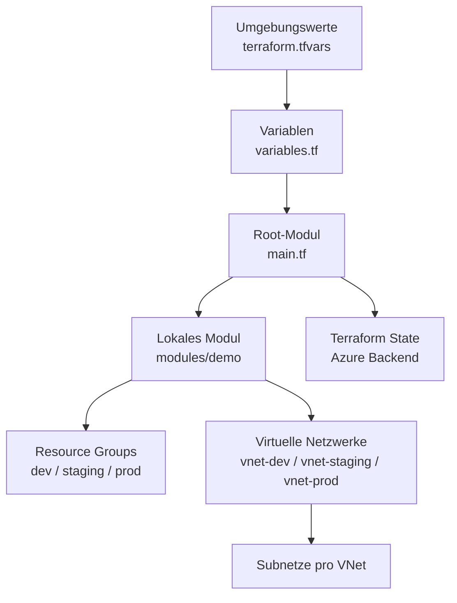

# Terraform Labs auf Azure

## Projektübersicht

Dieses Projekt zeigt, wie Azure-Ressourcen mit Terraform verwaltet und nachträglich in ein eigenes lokales Modul ausgelagert werden können. Als Beispiel werden mehrere Resource Groups, virtuelle Netzwerke und Subnetze für die Umgebungen `dev`, `staging` und `prod` definiert.

Die Umsetzung orientiert sich an den [Terraform Fundamentals Labs von Azure](https://azure-samples.github.io/terraform-fundamentals-labs/). Dabei werden zentrale Terraform-Konzepte wie Variablen, lokale Werte, Ausgaben, Abhängigkeiten, Module und State-Verwaltung praktisch angewendet.

## Zielsetzung

Das Projekt verfolgt zwei Ziele:

1. Azure-Ressourcen mit Terraform deklarativ zu erstellen.
2. Eine bereits bestehende Konfiguration sicher in ein lokales Terraform-Modul zu verschieben.

Die Infrastruktur wird nicht für jede Umgebung einzeln kopiert. Stattdessen werden die Umgebungen über Maps in `terraform.tfvars` beschrieben und mit `for_each` ausgerollt.

## Architektur



Das Root-Modul übergibt die Eingabewerte an das lokale Modul `modules/demo`. Das Modul erstellt daraus die Resource Groups, virtuellen Netzwerke und Subnetze. Die Resource Groups werden zuerst erstellt und anschliessend über ihre Namen den virtuellen Netzwerken zugeordnet.

## Projektstruktur

| Datei oder Ordner | Aufgabe |
|---|---|
| `main.tf` | Root-Modul, Provider, Modulaufruf und `moved`-Blöcke |
| `variables.tf` | Definition der Eingabevariablen |
| `terraform.tfvars` | Werte für Präfix, Umgebungen, Netzwerke und Tags |
| `outputs.tf` | Gibt die Resource-Group-IDs des Moduls aus |
| `modules/demo/main.tf` | Erstellt Resource Groups, VNets und Subnetze |
| `modules/demo/variables.tf` | Eingaben des lokalen Moduls |
| `modules/demo/outputs.tf` | Ausgaben des lokalen Moduls |
| `terraform.tfstate` | Lokaler Zustand der Infrastruktur, nicht für Git bestimmt |

## Terraform-Konfiguration

### Provider und Backend

In `terraform.tf` wird der AzureRM-Provider mit einer Version aus der Reihe `4.x` verwendet:

```hcl
terraform {
	required_providers {
		azurerm = {
			source  = "hashicorp/azurerm"
			version = "~> 4.0"
		}
	}

	backend "azurerm" {}
}
```

Der leere `azurerm`-Backend-Block ist für die Speicherung des Terraform States in Azure vorbereitet. Für die Initialisierung müssen die konkreten Backend-Werte, zum Beispiel Storage Account, Container und State-Key, separat angegeben werden. Ohne diese Konfiguration kann `terraform init` beim Backend-Setup nach fehlenden Angaben fragen. Die vorhandene `terraform.tfstate` zeigt, dass im Projekt auch ein lokaler State vorhanden ist; deshalb sollte vor der Ausführung geklärt werden, ob der State lokal oder im Azure-Backend verwaltet wird.

### Variablen

Die Root-Variablen steuern die gesamte Bereitstellung:

| Variable | Typ | Zweck |
|---|---|---|
| `prefix` | `string` | Präfix für Resource-Group-Namen |
| `region` | `string` | Azure-Region mit Validierung erlaubter Werte |
| `resource_groups` | `map(string)` | Schlüssel und Namen der Resource Groups |
| `virtual_networks` | `map(object(...))` | VNet-Konfiguration inklusive Subnetzen |
| `tags` | `map(any)` | Gemeinsame Tags für die Ressourcen |

In `terraform.tfvars` werden drei Umgebungen definiert:

```hcl
resource_groups = {
	dev     = "tflab_dev_rg"
	staging = "tflab_staging_rg"
	prod    = "tflab_prod_rg"
}
```

Die Resource Groups erhalten durch die Kombination aus `prefix` und Wert beispielsweise die Namen `test_tflab_dev_rg` und `test_tflab_prod_rg`.

Der in `terraform.tfvars` definierte Tag `cost_center = "CI"` wird über `tags = var.tags` an alle Resource Groups weitergegeben.

## Lokales Terraform-Modul

Das Root-Modul ruft das Modul `./modules/demo` auf:

```hcl
module "demo" {
	source = "./modules/demo"

	prefix           = var.prefix
	region           = var.region
	resource_groups  = var.resource_groups
	virtual_networks = var.virtual_networks
	tags             = var.tags
}
```

Der Vorteil eines lokalen Moduls ist, dass die Logik für Resource Groups, virtuelle Netzwerke und Subnetze an einer zentralen Stelle liegt. Das Root-Modul bleibt dadurch übersichtlich und kann dieselbe Lösung mit unterschiedlichen Eingabewerten wiederverwenden.

## Ressourcen im Modul

### Resource Groups

Die Resource Groups werden mit `for_each` aus der Map `var.resource_groups` erstellt. Dadurch entsteht pro Map-Eintrag eine Resource Group.

```hcl
resource "azurerm_resource_group" "demo" {
	for_each = var.resource_groups
	name     = "${var.prefix}_${each.value}"
	location = var.region
	tags     = var.tags
}
```

### Virtuelle Netzwerke

Auch die virtuellen Netzwerke werden mit `for_each` erstellt. Jedes VNet erhält einen eigenen Adressbereich und wird einer Resource Group über `resource_group_key` zugeordnet.

Die Konfiguration verwendet folgende Adressbereiche:

| Umgebung | VNet | Adressbereich |
|---|---|---|
| `dev` | `vnet-dev` | `10.0.0.0/16` |
| `staging` | `vnet-staging` | `10.1.0.0/16` |
| `prod` | `vnet-prod` | `10.2.0.0/16` |

### Subnetze und lokale Werte

Die Subnetze liegen verschachtelt in der VNet-Konfiguration. Der lokale Wert `local.subnets` wandelt diese verschachtelte Struktur in eine flache Map um.

Dabei wird für jedes Subnetz ein zusammengesetzter Schlüssel gebildet, beispielsweise:

```text
dev-subnet1
staging-subnet1
prod-subnet1
prod-subnet2
```

Diese Schlüssel werden anschliessend für `for_each` bei der Erstellung der Subnetze verwendet. Wird für ein Subnetz kein eigener Name angegeben, erzeugt das Modul automatisch einen Namen aus dem VNet-Namen und dem Subnetz-Schlüssel. Bei `prod-subnet2` entsteht dadurch beispielsweise der Subnetzname `vnet-prod-subnet2`.

## Umgebungen

Die drei Umgebungen werden in einer gemeinsamen Variablendatei beschrieben:

- **Development:** `vnet-dev` mit dem Subnetz `subnet-dev-1`
- **Staging:** `vnet-staging` mit dem Subnetz `subnet-staging-1`
- **Production:** `vnet-prod` mit zwei Subnetzen

Jede Umgebung besitzt einen eigenen IP-Adressbereich. Dadurch überschneiden sich die Netzwerke nicht und können unabhängig voneinander verwaltet werden.

## `moved`-Blöcke und Refactoring

Die `moved`-Blöcke sind besonders wichtig, weil die Ressourcen ursprünglich direkt im Root-Modul definiert waren und später in `modules/demo` verschoben wurden.

```hcl
moved {
	from = azurerm_resource_group.demo
	to   = module.demo.azurerm_resource_group.demo
}
```

Terraform erkennt dadurch, dass es sich weiterhin um dieselbe Ressource handelt. Wenn die ursprüngliche Ressource bereits im Terraform State vorhanden ist, wird sie nicht gelöscht und neu erstellt. Stattdessen wird nur ihre Adresse im Terraform State angepasst.

Dasselbe Prinzip wird für das VNet und das Subnetz verwendet:

- `azurerm_resource_group.demo` wird zu `module.demo.azurerm_resource_group.demo`
- `azurerm_virtual_network.demo` wird zu `module.demo.azurerm_virtual_network.demo`
- `azurerm_subnet.demo` wird zu `module.demo.azurerm_subnet.demo`

Ohne diese Blöcke könnte Terraform die Ressourcen als neu betrachten und eine unnötige Neuerstellung oder Löschung planen.

## Output

`modules/demo/outputs.tf` gibt die IDs aller Resource Groups als Map zurück:

```hcl
output "resource_group_ids" {
	value       = { for key, value in azurerm_resource_group.demo : key => value.id }
	description = "Resource group ids"
}
```

Das Root-Modul reicht diese Ausgabe in `outputs.tf` weiter:

```hcl
output "resource_group_ids" {
	value       = module.demo.resource_group_ids
	description = "Resource group ids"
}
```

Die Ausgabe kann nach einem erfolgreichen Apply mit folgendem Befehl angezeigt werden:

```bash
terraform output resource_group_ids
```

## Terraform-Ablauf

### Voraussetzungen

- Terraform CLI
- Azure CLI
- ein Azure-Abonnement mit ausreichenden Berechtigungen
- ein konfigurierter Azure Storage Account für den Remote State, falls das `azurerm`-Backend verwendet wird

Anmeldung bei Azure:

```bash
az login
az account show
```

### Initialisieren

Im Projektordner werden Provider, Modul und Backend initialisiert:

```bash
terraform init
```

### Konfiguration prüfen

```bash
terraform validate
```

### Plan erstellen

```bash
terraform plan
```

Da die Werte in `terraform.tfvars` automatisch geladen werden, ist kein zusätzlicher `-var-file`-Parameter erforderlich.

### Änderungen anwenden

```bash
terraform apply
```

Vor der Ausführung sollte der Plan geprüft werden. Terraform zeigt ausserdem die geplanten Änderungen an und verlangt normalerweise eine Bestätigung.

### State anzeigen

```bash
terraform state list
terraform output resource_group_ids
```

### Infrastruktur entfernen

```bash
terraform destroy
```

Dieser Befehl löscht die von Terraform verwalteten Azure-Ressourcen und sollte nur für eine nicht mehr benötigte Testumgebung verwendet werden.

## Sicherheit und State

Der Terraform State kann Informationen über die verwaltete Infrastruktur enthalten und sollte nicht öffentlich veröffentlicht werden. In diesem Projekt werden State-Dateien, `.tfvars`-Dateien und Terraform-Arbeitsverzeichnisse über `.gitignore` ausgeschlossen.

Bei Verwendung eines Azure-Backends sollte der State zentral in einem geschützten Storage Account liegen. Der Zugriff sollte über Azure-Rollen und nicht über öffentlich gespeicherte Zugangsschlüssel geregelt werden.

## Bezug zu den Fundamentals Labs

Das Projekt verwendet Inhalte aus mehreren Bereichen der offiziellen Azure-Labs:

| Thema | Umsetzung im Projekt |
|---|---|
| Core Terraform Workflow | `init`, `plan`, `apply` und `destroy` |
| Variables | `variables.tf` und `terraform.tfvars` |
| Locals | Aufbereitung der verschachtelten Subnetze |
| Expressions und Functions | `for_each`, `flatten`, `cidr`-Adressbereiche und bedingte Namen |
| Dependencies | Zuordnung von VNets zu Resource Groups |
| Modules | Wiederverwendung über `modules/demo` |
| Refactoring | `moved`-Blöcke beim Verschieben bestehender Ressourcen |
| Remote State | `backend "azurerm" {}` |